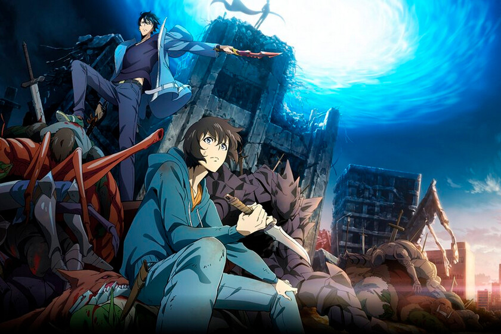
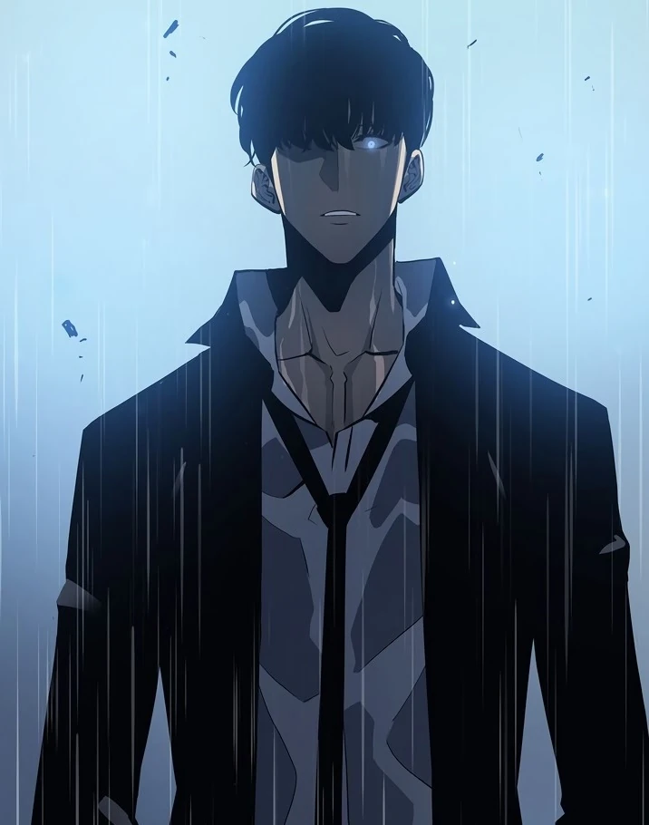
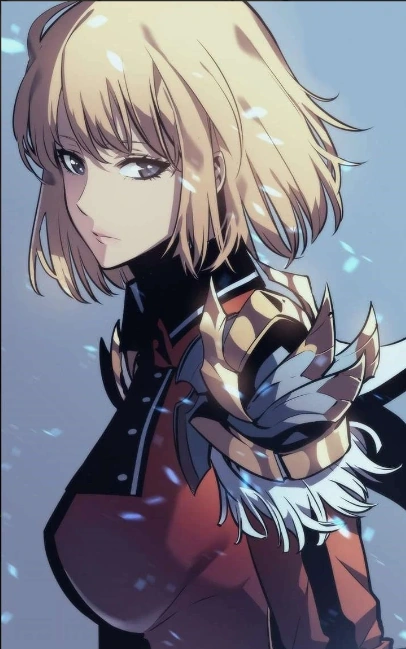
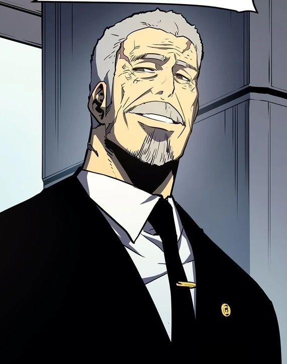

# ⚔️ SOLO LEVELING ⚔️

## 🎮 DESCRIPCION GENERAL 🎮
**Solo Leveling** es un anime adaptado de una novela web surcoreana escrita por **Chugong**. La historia sigue a **Sung Jin-Woo**, un cazador de rango E (el más debil de la humanidad) en un mundo donde portales que conectan con mazmorras han despertado a personas con poderes especiales.
Después de sobrevivir por poco a una mazmorra de rango S, Jin Woo recibe un misterioso poder conocido como **El Sistema**, una interfaz similar a un videojuego que solo él puede ver. Esto lo embarca en un viaje para convertirse en el cazador más poderoso, despertando secretos que amenazan el mundo entero.

## 🧙 PERSONAJES PRINCIPALES 🧙

### Sung Jinwoo (성진우) 
Es el protagonista de Solo Leveling . Es el cazador más fuerte del mundo y el segundo Monarca de las Sombras, tras heredar el puesto de su predecesor, Ashborn .

### Cha Hae-In (차해인) 
Es una cazadora coreana de rango S y vicemaestra del Gremio de Cazadores .

### Go Gunhee (고건희) 
Fue un cazador coreano de rango S y presidente de la Asociación de Cazadores de Corea .

## ✔️ SISTEMA DE RANGOS ✔️
### E  
Muy Bajo -> Los más débiles, a menudo considerados 'carnaza' o de apoyo básico.
### D
Bajo -> Principiantes con poder mágico limitado, superior a los de Rango E.
### C
Medio -> Luchadores de entidad, capaces de misiones estándar.
### B 
Alto -> Cazadores muy poderosos, capaces de realizar grandes gestas.
### A
Muy Alto -> Guerreros de poder demoledor, capaces de afrontar casi cualquier puerta.
### S
Máximo ->La élite mundial, estandartes de los gremios, con poder político y económico.

## 🎮 CONTENIDO MULTIMEDIA 🎮
### Manhwa/Novela
La obra original creada por Chugong comenzó como novela web y se adaptó a un popular webtoon (manhwa) ilustrado por Jang-Sung-Rak (Dubu), finalizando en 2021.

### Anime
Producido por A-1 Pictures, el anime es uno de los más exitosos en Crunchyroll, cubriendo ya gran parte de la historia con dos temporadas.

### Videojuegos
Incluye el título de acción y RPG, Solo Leveling: Arise y el futuro Solo Leveling: Karma, que conectará con la secuela, Ragnarok.

### Expansión
Se ha anunciado una ambiciosa adaptación en live-action.

## 🏆 PREMIOS Y NOMINACIONES 🏆
### 2024 
+ **Astra TV Awards** -> Mejor Serie de Anime - Ganador
+ **IGN Awards** -> Mejor Serie de Anime - Nominado

### 2025 
+ **Crunchyroll Anime Awards** -> Anime del Año - Ganador
+ **Astra TV Awards** -> Mejor Serie de Anime - Pendiente